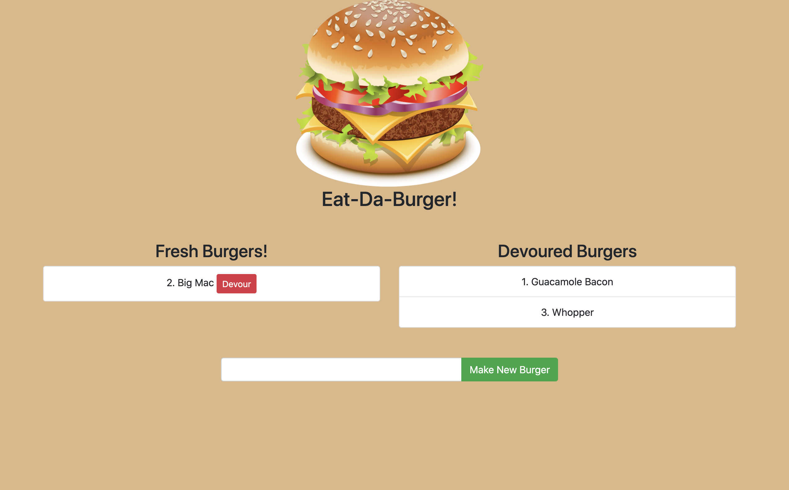

# EatDaBurger

## TABLE OF CONTENTS
* [Description](#description)
* [Usage](#usage)
* [Examples](#examples)
* [Questions](#questions)

## Description
A simple web app demonstrating basic CRUD actions using Node and MySQL. 

## Usage
To use, simply "create a burger" by typing in it's name and clicking the "Make New Burger" button. To "eat a burger", click the "Devour" button next to the corresponding burger. 

## Examples:

Deployed App: 

Preview Screenshot:

## Questions?
Please direct all questions to cseibert2667@gmail.com, and be sure to check out my other projects at [cseibert2667](https://www.github.com/cseibert2667).